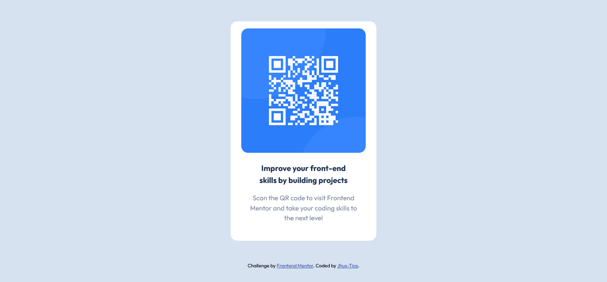

# Frontend Mentor - QR code component solution

This is a solution to the [QR code component challenge on Frontend Mentor](https://www.frontendmentor.io/challenges/qr-code-component-iux_sIO_H). Frontend Mentor challenges help you improve your coding skills by building realistic projects. 

## Table of contents

  - [Screenshot](#screenshot)
  - [Links](#links)
  - [Built with](#built-with)
- [Author](#author)

### Screenshot

### Links

- Live Site URL: [Add live site URL here](https://enchanting-naiad-040f96.netlify.app/)

### Built with

- Semantic HTML5 markup
- CSS custom properties
- Flexbox

## Author

- Website - [Justice Chime](https://www.your-site.com)
- Frontend Mentor - [@jhustice](https://www.frontendmentor.io/profile/jhustice)
- Twitter - [@_jhustice](https://www.twitter.com/_jhustice)
